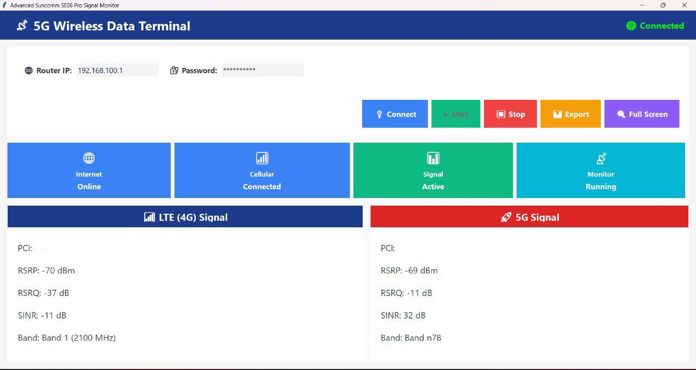

# Suncomm SE06 Pro Signal Monitor

A lightweight Windows application to monitor **Suncomm SE06 Pro 5G/4G router** performance in real time.  
This tool allows you to view detailed LTE (4G) and 5G signal information directly from your router’s interface.

## ✨ Features
- Real-time LTE (4G) and 5G signal monitoring  
- Displays RSRP, RSRQ, SINR, PCI, and band information  
- Shows internet, cellular and signal status  
- Export signal data for analysis  
- Full screen mode for better visibility  

## 📡 Supported Device
- **Suncomm SE06 Pro 5G CPE Router**

## 🚀 How to Use
1. Download and install the application.  
2. Enter your router’s IP address and password.  
3. Click **Connect** then **Start** to begin monitoring.

## ⚠️ Disclaimer
This application is provided **for informational and monitoring purposes only**.  
It does **not** modify router settings.  
The author assumes **no responsibility** for any issues or damages arising from its use.

## 💖 Support / Donate
If you find this application useful and would like to support its development, you can make a contribution via PayPal:

[Donate Here](https://www.paypal.com/paypalme/948d)

Your support helps improve the app and add new features. Thank you!

## 📝 License
This project is licensed under the [MIT License](./LICENSE).
